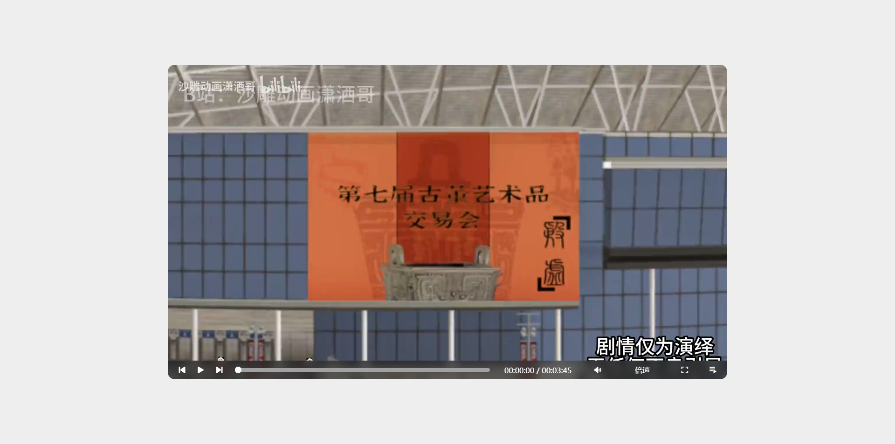
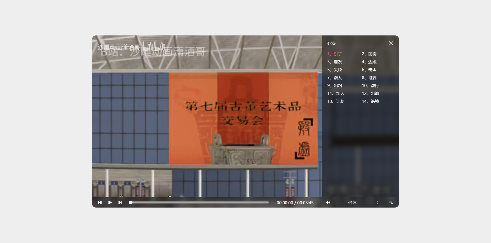

## 视频播放器
由默开发
### 项目目录
视频播放器
 
├── css
 
│&emsp;&nbsp;&nbsp;└── style.css
 
├── font
 
│&emsp;&nbsp;&nbsp;├── iconfont.ttf
 
│&emsp;&nbsp;&nbsp;├── iconfont.woff
 
│&emsp;&nbsp;&nbsp;└── iconfont.woff2
 
├── js
 
│&emsp;&nbsp;&nbsp;└── js.js
 
├── video
 
├── index.html
### 基于以下技术
HTML5：用于页面布局
 
CSS3：用于页面美化
 
JavaScript：用于页面事件

## 预览
### 视频未播放时

### 视频播放列表

### 感谢 沙雕动画潇洒哥